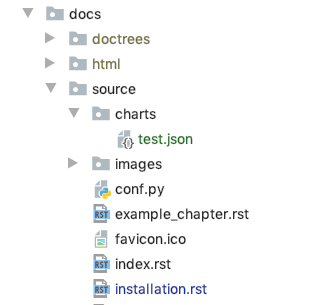

.. _quick_start:

============
Quick Start
============

.. _using_plotly:

Using plotly
============

If you don't know how to use plot.ly you won't get very far with ``sphinx_charts``!

Check out `plot.ly <https://plot.ly>`_ to figure out how to generate plots (or, if you're working with **C++** then
check out `cpplot <https://www.github.com/thclark/cpplot>`_).

Once you've got a couple of figures tried out and working, come on back!

.. _saving_plots_as_json:

Saving plots as JSON
====================

Plots need to be saved to a JSON file, whose contents are compatible with plot.ly's `json chart schema <https://plotly.com/chart-studio-help/json-chart-schema/>`_.

This can get really complicated for different types of chart, but typically consists of a ``data`` field and a ``layout`` field:

.. code-block:: python

   test_chart = {
     "data": [
       {
         "x": [1, 2, 3, 4, 5],
         "y": [1, 2, 4, 8, 81]
       }
     ],
     "layout": {
       "margin": {
         "t": 15,
         "b": 30,
         "r": 15,
         "l": 35
       }
     }
   }

All you need to do is save this to a json file. With python, this would look like:

.. code-block:: python

   import json

   with open("test.json", "w+") as f:
       json.dump(test_chart, f)

.. _using_the chart_directive:

Using the 'chart' directive
===========================

Make sure you've installed ``sphinx_charts.charts`` in your ``conf.py`` file (see :ref:`installation`).

Add the ``test.json`` file you created above (in :ref:`saving_plots_as_json`) to your docs source directory. I like to
put them into a ``charts`` subdirectory:

Include the following directive in your `*.rst` file:

.. code-block:: rst

   .. chart:: charts/test.json

       This is the caption of the chart

.. ATTENTION::

   The path argument, in this case ``charts/test.json``, should be **relative to your documentation source directory**
   (not relative to the present file)

And you should see something this, rendered in all its glory in your docs:

.. chart:: charts/test.json

    This is the caption of the chart
